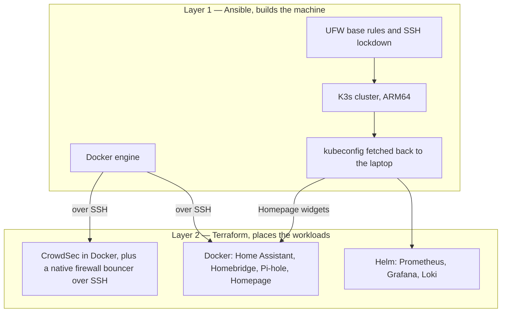

# Rainforest IoT Platform

Home automation and monitoring on a single Raspberry Pi 5. Ansible builds the machine, Terraform
puts the workloads on it.

## Architecture



Ansible prepares the host: the Docker engine, the base UFW rules, SSH configuration, the K3s
install, and fetching the kubeconfig back so the laptop can reach the cluster. Terraform places
what runs on top, mostly as Docker containers and Helm releases. The Docker provider reaches the
engine over SSH, so the containers need only the engine from Layer 1. The kubeconfig is for the
Kubernetes and Helm resources, plus Homepage, which reads a copy for its Kubernetes widgets.
Terraform reads both the Pi's kubeconfig and the Mac mini's kubeconfig for those widgets whenever
it plans, so `terraform plan` fails if either file is missing, even with the widgets turned off.
Layer 1 only fetches the Pi's.

Some Terraform resources still act on the host itself over SSH. CrowdSec's firewall bouncer has to
edit iptables, so Terraform installs it natively. Grafana Alloy's config file is written to the
host. The Pi-hole module installs its Prometheus exporter on the host as a systemd service, and
adds UFW rules letting the cluster's pod network reach the exporter ports. With
`enable_teleport_node` set, the Teleport config goes to `/etc/teleport`. UFW is therefore shared:
if you reset it and re-run Ansible, the Pi-hole rules stay gone until you run
`terraform apply -replace=module.pi-hole.null_resource.monitoring_firewall_rules`.

The Prometheus chart brings the CRDs. The Loki chart and the monitoring integrations follow it
after a fixed 60-second `time_sleep`, which exists only when `loki_enabled` is true. The Loki
ServiceMonitors that would use those CRDs are switched off in code, because a
`kubernetes_manifest` needs its CRD to exist when Terraform plans. CLAUDE.md's fallback for a CRD
conflict is `terraform destroy && terraform apply`, and that destroy also deletes the Docker
volumes, Home Assistant's configuration among them.

Rebuilding the host means running Ansible's `site.yml`, then `terraform apply`, then some work by
hand. The SSH steps above re-run only when their inputs change, so against an existing state each
one needs `terraform apply -replace=...`. The CrowdSec bouncer's API key has to be registered with
the new CrowdSec container after the first run. The Docker volumes come back empty unless you
restore them from a backup.

A third layer for custom applications is sketched but not built.

## Prerequisites

- Raspberry Pi 5 with SSH access
- Ansible inventory configured (`ansible/inventory.yml`)
- Terraform >= 1.0 with Helm provider
- kubectl for cluster management

## Quick Start

1. **Setup Infrastructure (Layer 1)**

```bash
# Configure Ansible inventory
# Edit ansible/inventory.yml with your Pi's IP/hostname

# Complete infrastructure deployment (system hardening + K3s)
ansible-playbook -i ansible/inventory.yml ansible/site.yml

# Validate infrastructure
ansible-playbook -i ansible/inventory.yml ansible/playbooks/validate-setup.yml
```

2. **Deploy Workloads (Layer 2)**

```bash
# Configure Terraform
cp terraform.tfvars.example terraform.tfvars
# Edit terraform.tfvars with your configuration

# Create Docker context for remote deployment
docker context create raspberrypi-5 --docker "host=ssh://raspberrypi-5"

# Deploy all workloads with dependency management
terraform init
terraform plan    # Safe to run repeatedly
terraform apply   # Deploy with automatic sequencing
```

3. **Configure Services (Optional)**

```bash
# Set up Wake-on-LAN for Homebridge (automated)
ansible-playbook -i ansible/inventory-wol.yml ansible/playbooks/setup-homebridge-wol.yml
```

## Services

| Service           | Description                            | Port      | Status    |
| ----------------- | -------------------------------------- | --------- | --------- |
| **HomeAssistant** | Home automation platform               | 8123      | ✅ Active |
| **Homebridge**    | HomeKit bridge for non-HomeKit devices | 8581      | ✅ Active |
| **Homepage**      | Dashboard and service portal           | 80        | ✅ Active |
| **Pi-hole**       | DNS-based ad blocker                   | 8080      | ✅ Active |
| **OpenSpeedTest** | Network speed testing                  | 3000/3001 | ✅ Active |

## Security

- ✅ No privileged containers
- ✅ Resource limits on all containers
- ✅ Health checks and restart policies
- ✅ Read-only Docker socket mounts
- ✅ Minimal container capabilities
- ✅ Structured logging with rotation

## Configuration

### Home Assistant

1. Access HomeAssistant at `http://your-pi-hostname:8123`
2. Complete initial setup
3. **HACS Installation**: Automatically installed when `enable_hacs = true` (default)
   - Navigate to Settings → Devices & Services
   - Add HACS integration and authenticate with GitHub
   - See [docs/homeassistant-hacs-setup.md](docs/homeassistant-hacs-setup.md) for details

### Homebridge

1. Access Homebridge at `http://your-pi-hostname:8581`
2. Complete the setup wizard (auto-generates PIN and QR codes)
3. **Wake-on-LAN Setup**: Use automated Ansible playbook (recommended)
   ```bash
   # Automated SSH key setup for WoL functionality
   ansible-playbook -i ansible/inventory-wol.yml ansible/playbooks/setup-homebridge-wol.yml
   ```
4. Install Wake-on-LAN plugin via web UI:
   - Go to Plugins tab → Search "homebridge-wol" → Install
5. Add to iOS Home app using the QR code or PIN

**Detailed Setup Guides:**
- [Homebridge Infrastructure & Configuration](docs/homebridge-setup.md)
- [Wake-on-LAN Setup Guide](docs/homebridge-wol-manual-setup.md) - **Automated + Manual methods**

### USB devices

For Zigbee/Z-Wave dongles, set in `terraform.tfvars`:

```hcl
enable_usb_devices = true
enable_hacs = true  # Enable HACS installation (default)
```

## Maintenance

### Viewing logs

```bash
docker logs homeassistant
docker logs pihole
```

### Updating containers

Updates are managed via Terraform. To update a container:

```bash
docker pull ghcr.io/home-assistant/home-assistant:stable
terraform apply -replace=module.homeassistant.docker_container.homeassistant
```

### Backing up configuration

```bash
docker run --rm -v homeassistant_configuration:/source -v $(pwd):/backup alpine tar czf /backup/homeassistant-backup.tar.gz -C /source .
```

## Troubleshooting

### Container problems

```bash
# Check container status
docker ps -a

# View container logs
docker logs <container-name>

# Apply only necessary changes (recommended)
terraform plan && terraform apply

# Force container replacement (rarely needed)
terraform apply -replace=module.<service>.docker_container.<container>
```

### Terraform problems

```bash
# Check what Terraform wants to change
terraform plan

# Target specific module if needed
terraform apply -target=module.homepage

# Refresh state if containers changed outside Terraform
terraform refresh
```

### Network problems

- Ensure SSH access is working
- Check Docker context: `docker context ls`
- Verify Pi-hole DNS on port 8080 (not 80)
- Homepage host validation resolved automatically

## Configuration variables

Key options in `terraform.tfvars`:

### Connection settings

```hcl
raspberry_pi_hostname = "raspberrypi-5"  # Your Pi's hostname or IP
raspberry_pi_user = "rainforest"         # SSH username
raspberry_pi_port = 22                   # SSH port
```

### Hardware options

```hcl
enable_usb_devices = true     # Enable for Zigbee/Z-Wave dongles
homeassistant_memory = 1024   # Memory limit in MB
homebridge_memory = 512       # Homebridge memory limit in MB
```

### Network ports

```hcl
homepage_port = 80           # Dashboard port
pihole_web_port = 8080       # Pi-hole admin interface
homebridge_web_port = 8581   # Homebridge web UI
openspeedtest_ports = {
  http  = 3000
  https = 3001
}
```

See `variables.tf` for all customizable options.
